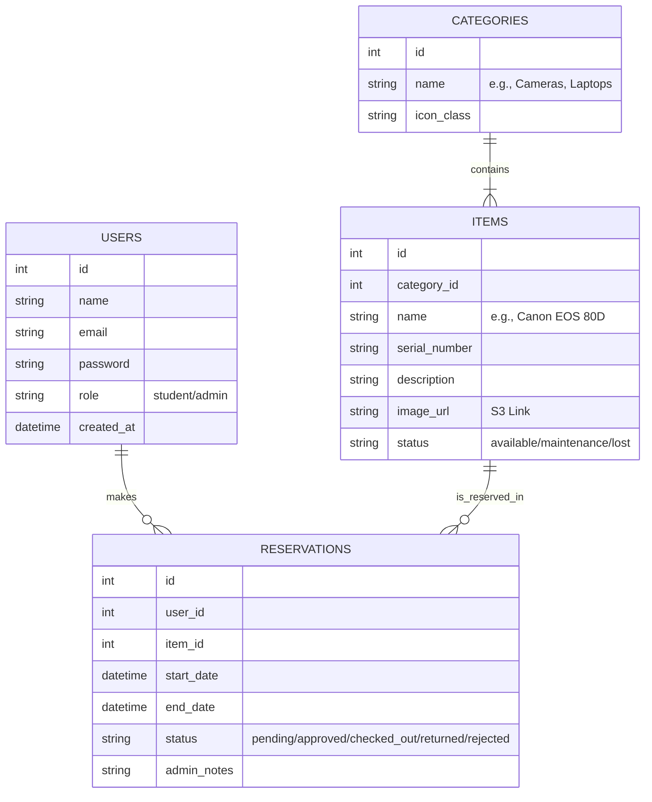

# Database Schema

This project uses a Relational Database.

## Entity Relationship Diagram (ERD)

```mermaid
erDiagram
    USERS ||--o{ RESERVATIONS : "makes"
    USERS {
        int id
        string name
        string email
        string password
        string role "student/admin"
        datetime created_at
    }

    CATEGORIES ||--|{ ITEMS : "contains"
    CATEGORIES {
        int id
        string name "e.g., Cameras, Laptops"
        string icon_class
    }

    ITEMS ||--o{ RESERVATIONS : "is_reserved_in"
    ITEMS {
        int id
        int category_id
        string name "e.g., Canon EOS 80D"
        string serial_number
        string description
        string image_url "S3 Link"
        string status "available/maintenance/lost"
    }

    RESERVATIONS {
        int id
        int user_id
        int item_id
        datetime start_date
        datetime end_date
        string status "pending/approved/checked_out/returned/rejected"
        string admin_notes
    }
```
